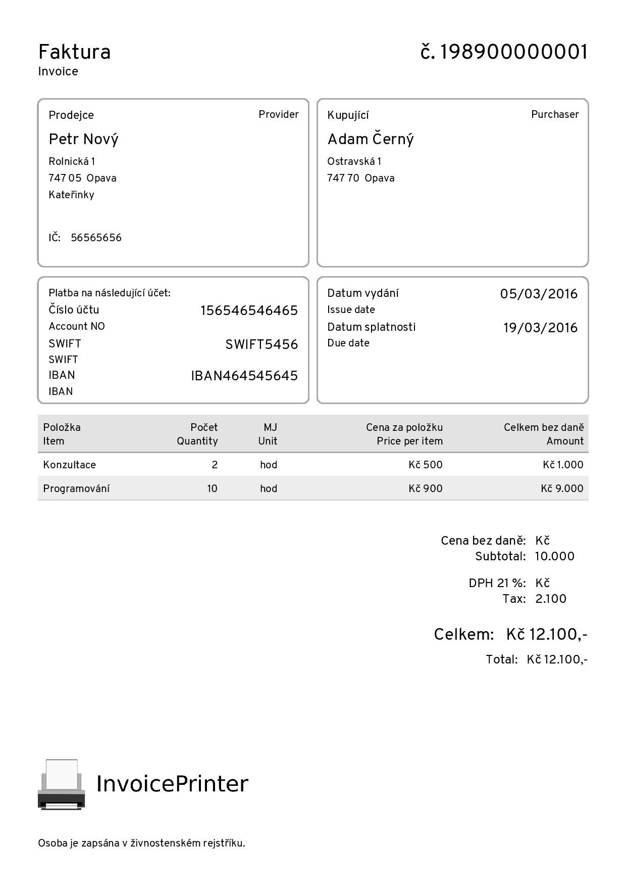

<a href="http://strzibny.github.io/invoice_printer/">
  
</a>

Super simple PDF invoicing in pure Ruby (based on Prawn library).

InvoicePrinter does not impose any validations nor calculations on you. It is
designed only to provide an interface to build the PDF version of these documents.

## Features

- Invoice/document name and number
- Purchaser and provider boxes with addresses and identificaton numbers
- Payment method box showing banking details including SWIFT and IBAN fields
- Issue/due dates box
- Configurable items' table with item description, quantity, unit, price per unit, tax and item's total amount fields
- Final subtotal/tax/total info box
- Page numbers
- Configurable labels & sublabels (optional little labels)
- Configurable font file
- Logotype (as image scaled to fit 50px of height)
- Background (as image)
- Stamp & signature (as image)
- Note
- Well tested

## Example

| Simple invoice |
| -------------- |
| <a href="https://github.com/strzibny/invoice_printer/raw/master/examples/promo.pdf"></a>|

See more usecases in the `examples/` directory.

## Installation

Add this line to your application's Gemfile:

```ruby
gem 'invoice_printer'
```

And then execute:

    $ bundle

Or install it yourself as:

    $ gem install invoice_printer --pre

## Usage

The simplest way how to create your invoice PDF is to create an invoice object
and pass it to printer:

```ruby
item = InvoicePrinter::Document::Item.new(
  ...
)

invoice = InvoicePrinter::Document.new(
  ...
  items: [item, ...]
)

InvoicePrinter.print(
  document: invoice,
  file_name: 'invoice.pdf'
)

# Or render PDF directly
InvoicePrinter.render(
  document: invoice
)
```

Here is an full example for creating the document object:

```ruby
item = InvoicePrinter::Document::Item.new(
  name: 'Web consultation',
  quantity: nil,
  unit: 'hours',
  price: '$ 25',
  tax: '$ 1',
  amount: '$ 100'
)

invoice = InvoicePrinter::Document.new(
  number: '201604030001',
  provider_name: 'Business s.r.o.',
  provider_tax_id: '56565656',
  provider_tax_id2: '465454',
  provider_street: 'Rolnicka',
  provider_street_number: '1',
  provider_postcode: '747 05',
  provider_city: 'Opava',
  provider_city_part: 'Katerinky',
  provider_extra_address_line: 'Czech Republic',
  purchaser_name: 'Adam',
  purchaser_tax_id: '',
  purchaser_tax_id2: '',
  purchaser_street: 'Ostravska',
  purchaser_street_number: '1',
  purchaser_postcode: '747 70',
  purchaser_city: 'Opava',
  purchaser_city_part: '',
  purchaser_extra_address_line: '',
  issue_date: '19/03/3939',
  due_date: '19/03/3939',
  subtotal: '175',
  tax: '5',
  tax2: '10',
  tax3: '20',
  total: '$ 200',
  bank_account_number: '156546546465',
  account_iban: 'IBAN464545645',
  account_swift: 'SWIFT5456',
  items: [item],
  note: 'A note...'
)
```

### Ruby on Rails

If you want to use InvoicePrinter for printing PDF documents directly from Rails
actions, you can:

```ruby
# GET /invoices/1
def show
  invoice = InvoicePrinter::Document.new(...)

  respond_to do |format|
    format.pdf {
      @pdf = InvoicePrinter.render(
        document: invoice
      )
      send_data @pdf, type: 'application/pdf', disposition: 'inline'
    }
  end
end
```

## Customization

### Localization

To localize your documents you can set both global defaults or instance
overrides:

```ruby
InvoicePrinter.labels = {
  provider: 'Dodavatel'
}

labels = {
  purchaser: 'Customer'
}

InvoicePrinter.print(
  document: invoice,
  labels: labels,
  file_name: 'invoice.pdf'
)
```

Here is the full list of labels to configure. You can paste and edit this block
to `initializers/invoice_printer.rb` if you are using Rails.

```ruby
InvoicePrinter.labels = {
  name: 'Invoice'
  provider: 'Provider',
  purchaser: 'Purchaser',
  tax_id: 'Identification number',
  tax_id2: 'Identification number',
  payment: 'Payment',
  payment_by_transfer: 'Payment by bank transfer on the account below:',
  payment_in_cash: 'Payment in cash',
  account_number: 'Account NO',
  swift: 'SWIFT',
  iban: 'IBAN',
  issue_date: 'Issue date',
  due_date: 'Due date',
  item: 'Item',
  quantity: 'Quantity',
  unit: 'Unit',
  price_per_item: 'Price per item',
  amount: 'Amount',
  tax: 'Tax',
  tax2: 'Tax 2',
  tax3: 'Tax 3',
  subtotal: 'Subtotal'
  total: 'Total'
}
```

You can also use sublabels feature to provide the document in two languages:

```ruby
labels = {
  ...
}

sublabels = {
  name: 'Faktura',
  provider: 'Prodejce',
  purchaser: 'Kupující',
  tax_id: 'IČ',
  tax_id2: 'DIČ',
  payment: 'Forma úhrady',
  payment_by_transfer: 'Platba na následující účet:',
  account_number: 'Číslo účtu',
  issue_date: 'Datum vydání',
  due_date: 'Datum splatnosti',
  item: 'Položka',
  quantity: 'Počet',
  unit: 'MJ',
  price_per_item: 'Cena za položku',
  amount: 'Celkem bez daně',
  subtotal: 'Cena bez daně',
  tax: 'DPH 21 %',
  total: 'Celkem'
}

labels.merge!({ sublabels: sublabels })

...
```

Now the document will have a little sublabels next to the original labels in Czech.

### Font

To support specific characters you might need to specify a TTF font to be used:

``` ruby
InvoicePrinter.print(
  ...
  font: File.expand_path('../Overpass-Regular.ttf', __FILE__)
)
```

We recommend you DejaVuSans and Overpass fonts.

### Background

To include a background image you might need to create the file according to the size and resolution to be used (see: [examples/background.png](https://github.com/strzibny/invoice_printer/blob/master/examples/background.png)):

``` ruby
InvoicePrinter.print(
  ...
  background: File.expand_path('../background.png', __FILE__)
)
```

## Copyright

Copyright 2015-2017 &copy; [Josef Strzibny](http://strzibny.name/). MIT licensed.

Originally extracted from and created for an open source single-entry invoicing app [InvoiceBar](https://github.com/strzibny/invoicebar).
